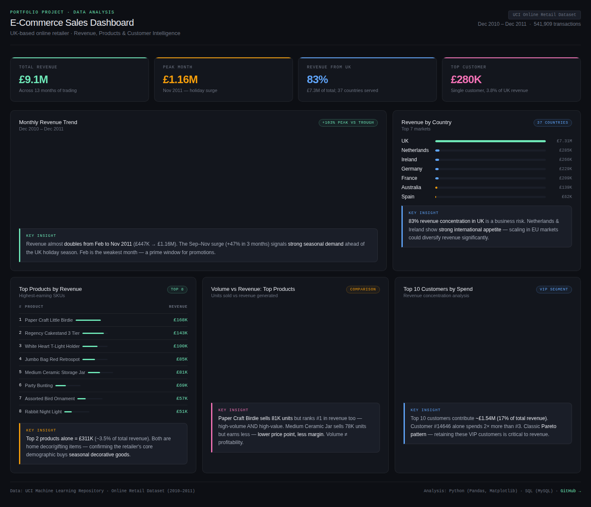

# E-Commerce Sales Analysis 🛒📊

> End-to-end data analysis project using **Python**, **SQL (MySQL)**, and **Matplotlib** on a real-world UK e-commerce dataset (541,909 transactions).



---

## 📌 Project Overview

This project analyses one year of transactional data from a UK-based online retailer (Dec 2010 – Dec 2011). The goal was to uncover actionable business insights across revenue trends, product performance, customer behaviour, and geographic distribution.

**Dataset:** [UCI Online Retail Dataset](https://archive.ics.uci.edu/ml/datasets/online+retail) — 541,909 rows, 8 columns  
**Tools used:** Python · Pandas · Matplotlib · MySQL · Excel CSV outputs

---

## 📊 Live Dashboard

Open `ecommerce-dashboard.html` in any browser to explore the interactive dashboard — no server needed.

---

## 💡 Key Business Insights

### 1. 📈 Strong Seasonal Revenue Surge
Revenue nearly **doubled from Feb 2011 (£447K) to Nov 2011 (£1.16M)** — the sharpest jump occurring in Sep–Nov (+47% in just 3 months). This is driven by UK holiday shopping behaviour.

**Recommendation:** Stock up on inventory by August and run targeted promotions in February (the weakest month) to smooth the revenue curve.

---

### 2. 🌍 83% Revenue Concentrated in the UK — A Business Risk
The UK alone accounts for **£7.3M out of £9.1M total revenue**. Netherlands (£285K), Ireland (£266K), and Germany (£229K) show strong international appetite but remain underleveraged.

**Recommendation:** Scaling EU marketing spend could significantly diversify revenue and reduce single-market dependency risk.

---

### 3. 📦 High Volume ≠ High Profitability
The **Medium Ceramic Jar** sells ~78K units but earns only £81K. **Paper Craft Little Birdie** sells a similar volume (~81K units) yet earns £168K — more than 2× the revenue.

**Recommendation:** Before scaling production of high-volume products, conduct a margin audit. Volume alone is not a reliable proxy for profitability.

---

### 4. 👑 Top 10 Customers = 17% of Total Revenue
The top 10 customers contributed approximately **£1.54M**. Customer #14646 alone spent £280K — nearly 2× the second-highest spender.

**Recommendation:** This is a classic Pareto distribution. Losing even 2–3 of these VIP accounts would materially impact annual revenue. A loyalty or account management programme is essential.

---

## 📁 Project Structure

```
ecommerce-data-analysis/
│
├── data/
│   ├── Raw/                     # Original dataset (Online_Retail.csv)
│   ├── processed/               # Cleaned dataset after null removal
│   └── outputs/                 # Final CSV outputs from SQL queries
│       ├── Monthly_Revenue_Trend.csv
│       ├── Top_Selling_Products.csv
│       ├── Highest_Revenue_Product.csv
│       ├── country_revenue.csv
│       └── top_customers.csv
│
├── notebooks/
│   ├── data_cleaning.ipynb      # Null handling, type casting, derived columns
│   └── analysis.ipynb           # EDA, visualisations, trend analysis
│
├── sql/
│   └── analysis_queries.sql     # All SQL queries (KPIs, products, customers, time)
│
├── images/
│   ├── monthly_sales.png
│   └── top_products.png
│
├── ecommerce-dashboard.html     # Interactive browser dashboard
├── dashboard-preview.png        # Dashboard screenshot (this README)
└── README.md
```

---

## 🔍 Analysis Performed

| Category | Details |
|---|---|
| **Data Cleaning** | Removed nulls in CustomerID, filtered negative quantities (returns), added TotalPrice column |
| **Revenue KPIs** | Total revenue, average order value, total orders, unique customers |
| **Product Analysis** | Top 10 by units sold vs top 10 by revenue — volume vs margin comparison |
| **Customer Analysis** | Top spenders, repeat customer identification, revenue per customer |
| **Geographic Analysis** | Revenue breakdown across 37 countries |
| **Time Analysis** | Monthly revenue trend, seasonal pattern identification |

---

## ▶️ How to Run

**Python notebooks:**
```bash
pip install pandas matplotlib jupyter
jupyter notebook notebooks/data_cleaning.ipynb
```

**SQL queries:**
```sql
-- Run in MySQL after importing Online_Retail.csv
USE retail;
SOURCE sql/analysis_queries.sql;
```

**Dashboard:**
```
Just open ecommerce-dashboard.html in your browser — no setup needed.
```

---

## 📦 Dataset Source

- **Name:** Online Retail  
- **Source:** [UCI Machine Learning Repository](https://archive.ics.uci.edu/ml/datasets/online+retail)  
- **Period:** December 2010 – December 2011  
- **Records:** 541,909 transactions · 8 columns  
- **Origin:** UK-based non-store online retailer

---

## 👤 Author

**Sudhanshu Sharma**  
Data Analyst · Python · SQL · Visualization  
[LinkedIn](www.linkedin.com/in/sudhanshu-sharma-64292628a) 
